# Architecture Overview

This document describes the architecture of the MongoDB RAG chat frontend (`rag-app-ui`).

## What It Does

A **frontend chat interface** for the `rag-app` backend. It is a static, framework-free web app (HTML + CSS + vanilla JavaScript) that talks to the FastAPI server over HTTP.

## Where It Sits in the System

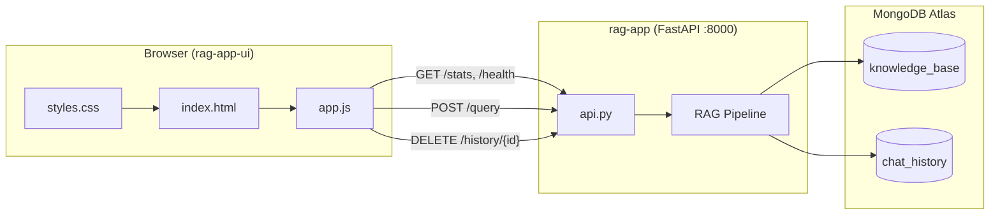

The frontend never touches MongoDB, Voyage AI, or the LLM directly — it only calls the API.

## Technology Stack

| Layer | Technology |
|-------|------------|
| Markup | HTML5 (`index.html`) |
| Styling | CSS3 with custom properties (`styles.css`) |
| Logic | Vanilla JavaScript (`app.js`) |
| Server | Optional static file server (`serve.sh` / Python `http.server`) |
| Backend dependency | `rag-app` FastAPI on `http://localhost:8000` |

No `package.json`, no bundler, no framework — open `index.html` or serve static files.

## Project Structure

```
rag-app-ui/
├── index.html          # Static markup — welcome message baked in
├── css/
│   └── styles.css      # Design system + responsive + dark mode
├── js/
│   └── app.js          # All application logic
├── serve.sh            # python -m http.server 8085
└── README.md
```

## UI Layout

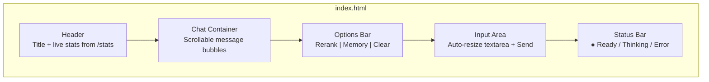

| Region | Element ID | Purpose |
|--------|-----------|---------|
| Header stats | `#stats` | Shows doc count, embedding model, dimensions |
| Chat area | `#chatContainer` | User + assistant message bubbles |
| Rerank toggle | `#useRerank` | Maps to `use_rerank` in API request |
| Memory toggle | `#useMemory` | Controls whether `session_id` is sent |
| Input | `#queryInput` | Auto-growing textarea (max 120px) |
| Send button | `#sendBtn` | Disabled while loading |
| Status | `#statusBar` | Connection / loading / error state |

## Application Lifecycle

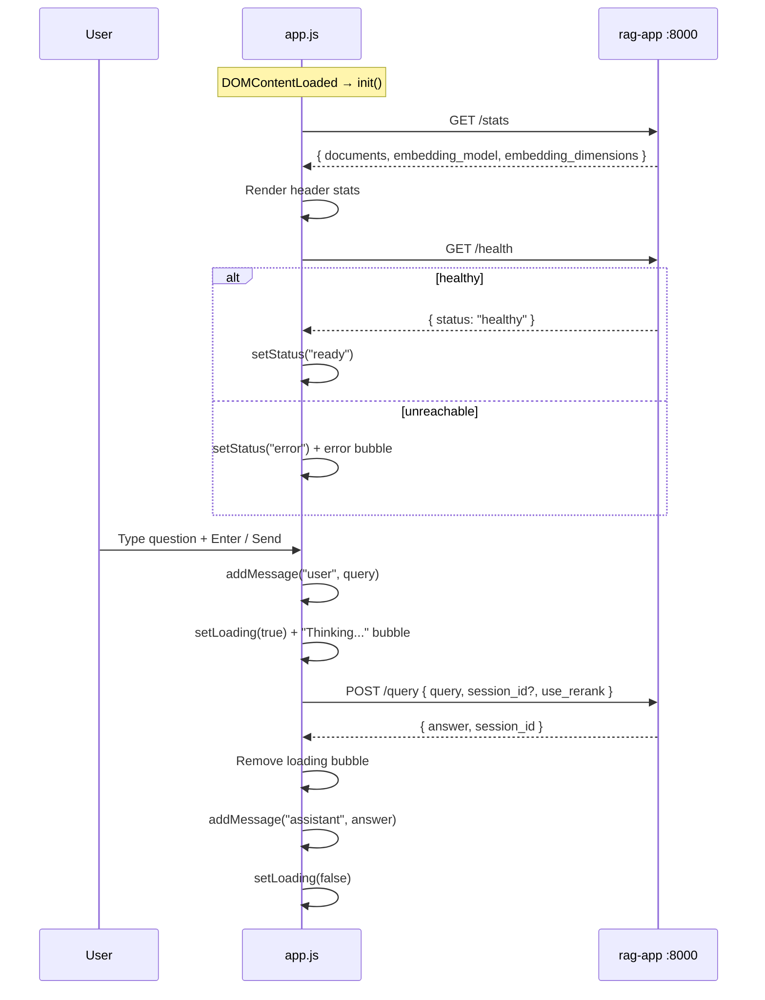

## Configuration & State

Defined in `js/app.js`:

```javascript
const CONFIG = {
    API_URL: 'http://localhost:8000',
    SESSION_ID: 'web-user-' + Date.now(),
    MAX_RETRIES: 3,
    RETRY_DELAY: 1000
};
```

| Setting | Value | Effect |
|---------|-------|--------|
| `API_URL` | `http://localhost:8000` | Backend base URL (change for deployment) |
| `SESSION_ID` | `web-user-{timestamp}` | Unique per page load; enables multi-turn memory |
| `MAX_RETRIES` | 3 | Network retry attempts on failed fetch |
| `isLoading` | boolean | Prevents double-submit while waiting |

**Session ID behavior:** Generated once when the page loads. If "Remember Conversation" is checked, every query sends the same `session_id`, so the backend's `ChatMemory` can retrieve prior turns. Unchecking memory sends `session_id: null` — each query is stateless from the server's perspective.

## Query Flow

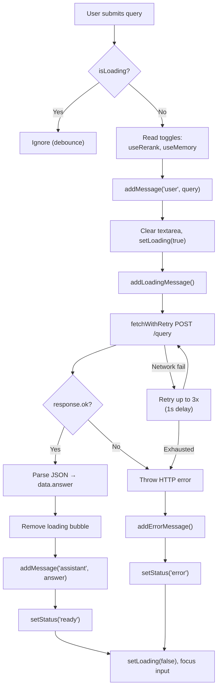

**API request body:**

```json
{
  "query": "What are MongoDB backup best practices?",
  "session_id": "web-user-1718654321000",
  "use_rerank": false
}
```

`session_id` is `null` when "Remember Conversation" is unchecked.

## API Endpoints Used

| Endpoint | When | UI behavior |
|----------|------|-------------|
| `GET /stats` | On init | Header shows doc count, model, dimensions |
| `GET /health` | On init | Green "Ready" or red error state |
| `POST /query` | Every send | Main RAG interaction |
| `DELETE /history/{session_id}` | Clear Chat (if memory on) | Wipes server-side conversation |

**Not used by the UI** (available on backend but unused here):

- `GET /search` — raw vector search without LLM
- `GET /history/{session_id}` — fetch history (UI doesn't reload past messages on refresh)

## Chat Rendering

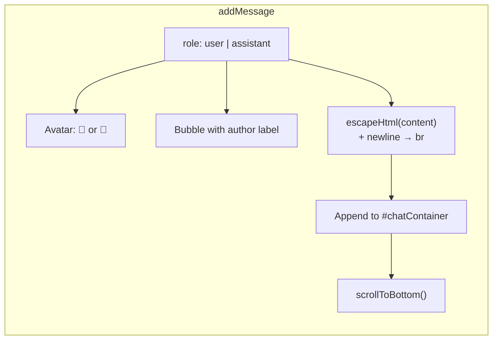

| Type | CSS class | Appearance |
|------|-----------|------------|
| User | `.message.user` | Right-aligned, green gradient bubble |
| Assistant | `.message.assistant` | Left-aligned, white/dark surface bubble |
| Loading | `.message.loading` | "Thinking..." with blink animation |
| Error | `.message.error` | Red-tinted warning bubble |

**XSS protection:** `escapeHtml()` uses `textContent` assignment before inserting into DOM — user and API text is escaped; newlines become `<br>`.

## Clear Chat Behavior

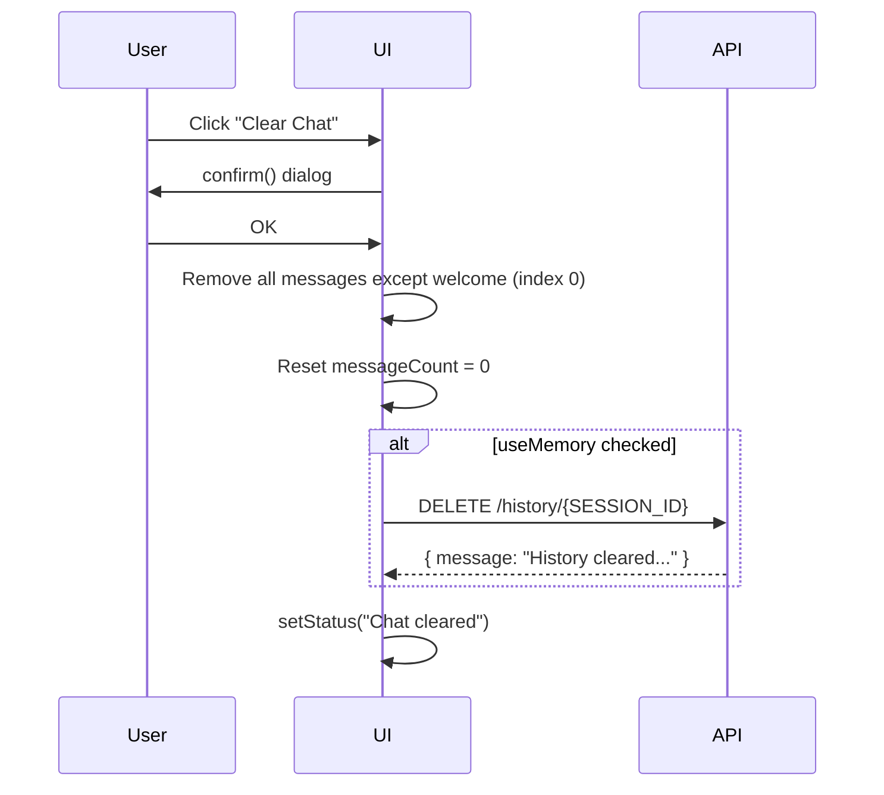

Clearing resets the **visible** chat and server history. The `SESSION_ID` stays the same for the page session — a full page reload generates a new `SESSION_ID`.

## UI Options → Backend Mapping

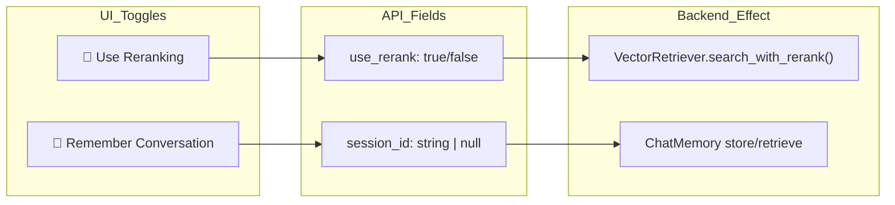

| UI Toggle | Default | Backend effect |
|-----------|---------|----------------|
| Use Reranking | Off | Standard vector search vs. reranked results |
| Remember Conversation | **On** | Persists multi-turn context in `chat_history` collection |

## Styling Architecture

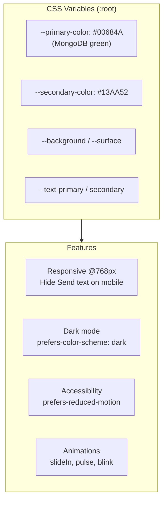

## Keyboard & Input UX

| Action | Behavior |
|--------|----------|
| **Enter** | Send query (if not loading and input non-empty) |
| **Shift+Enter** | New line in textarea |
| **Input event** | Auto-resize textarea up to 120px |
| **On load** | Input auto-focused |
| **While loading** | Input + Send disabled |

## Error Handling & Resilience

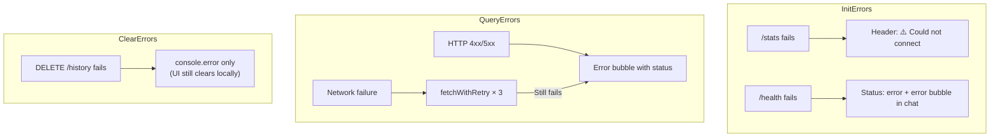

Retries only cover **network-level** fetch failures, not HTTP error status codes.

## Deployment Model

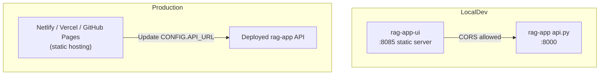

**CORS:** The backend allows all origins (`allow_origins=["*"]` in `api.py`), so the static frontend can be hosted anywhere and still call the API — as long as `CONFIG.API_URL` points to the right server.

**To deploy:** Change `API_URL` in `js/app.js`:

```javascript
API_URL: 'https://your-api.example.com'
```

## What the UI Deliberately Does Not Do

| Feature | Status | Why |
|---------|--------|-----|
| Show retrieved source chunks | ❌ | API returns only `answer`, not citations |
| Reload chat on page refresh | ❌ | Never calls `GET /history/{id}` |
| Vector search-only mode | ❌ | `/search` endpoint unused |
| Auth / API keys | ❌ | Open API assumed (workshop/local use) |
| Markdown rendering | ❌ | Plain text with `escapeHtml` + `<br>` |
| Streaming responses | ❌ | Waits for full `POST /query` response |

## Comparison: `rag-app` vs `rag-app-ui`

| Aspect | `rag-app` | `rag-app-ui` |
|--------|-----------|--------------|
| Role | RAG engine + API | Chat frontend |
| Language | Python | HTML/CSS/JS |
| Intelligence | Embeddings, search, LLM | None (display only) |
| Storage | MongoDB Atlas | Browser DOM only |
| Entry points | `api.py`, `query.py`, `ingest_data.py` | `index.html` |
| Conversation memory | `ChatMemory` in MongoDB | Sends `session_id` toggle |
| Dependencies | pymongo, voyageai, fastapi, etc. | Zero npm packages |

## End-to-End User Journey

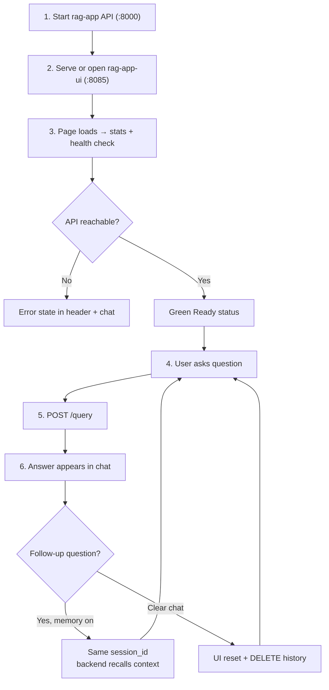
