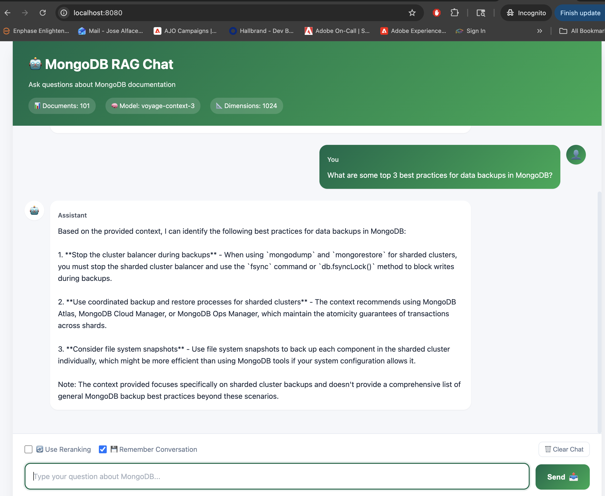

# MongoDB RAG App - Frontend

A beautiful, modern web interface for the MongoDB RAG API.

## 🖼️ Preview



## 🎨 Features

- **Clean, Modern UI** - Professional design with smooth animations
- **Real-time Chat** - Interactive chat interface with message bubbles
- **Conversation Memory** - Toggle to remember conversation context
- **Result Reranking** - Option for improved answer quality
- **Auto-resize Input** - Textarea grows as you type
- **Status Indicators** - Real-time connection and loading status
- **Error Handling** - User-friendly error messages
- **Responsive Design** - Works on desktop, tablet, and mobile
- **Dark Mode Support** - Automatically adapts to system preferences
- **Keyboard Shortcuts** - Press Enter to send, Shift+Enter for new line

## 🚀 Quick Start

### Option 1: Open Directly (Simplest)

Just double-click `index.html` in Finder or run:

```bash
open index.html
```

**Note**: Make sure the API server is running on `http://localhost:8000`

### Option 2: Serve with Python

```bash
# From the frontend directory
python -m http.server 8085

# Then open in browser:
# http://localhost:8085
```

### Option 3: Serve with Node.js

```bash
# Install http-server globally
npm install -g http-server

# Serve the frontend
http-server -p 8085

# Open http://localhost:8085
```

## 📋 Prerequisites

Make sure the RAG API is running:

```bash
# From the rag-app root directory
cd ..
source venv/bin/activate
python api.py
```

The API should be available at `http://localhost:8000`

## 🎯 How to Use

1. **Start the API Server** (see above)
2. **Open the Frontend** (see Quick Start options)
3. **Type your question** in the input box
4. **Click Send** or press **Enter**
5. **Get instant answers** from MongoDB documentation!

### Options

- **🔄 Use Reranking**: Enable for better (but slightly slower) results
- **💾 Remember Conversation**: Keep conversation context across queries
- **🗑️ Clear Chat**: Reset the conversation

## 🏗️ Project Structure

```
frontend/
├── index.html          # Main HTML file
├── css/
│   └── styles.css     # All styles
├── js/
│   └── app.js         # Application logic
└── README.md          # This file
```

## ⚙️ Configuration

To change the API endpoint, edit `js/app.js`:

```javascript
const CONFIG = {
    API_URL: 'http://localhost:8000',  // Change this
    // ...
};
```

## 🎨 Customization

### Change Colors

Edit `css/styles.css`:

```css
:root {
    --primary-color: #00684A;      /* Main green */
    --secondary-color: #13AA52;    /* Secondary green */
    /* ... other colors */
}
```

### Change Welcome Message

Edit `index.html`, find the welcome message:

```html
<div class="message-text">
    👋 Hi! I'm your MongoDB documentation assistant...
</div>
```

## 🌐 Browser Support

- ✅ Chrome/Edge 90+
- ✅ Firefox 88+
- ✅ Safari 14+
- ✅ Opera 76+

## 📱 Mobile Support

The interface is fully responsive and works great on:
- 📱 Mobile phones
- 📱 Tablets
- 💻 Laptops
- 🖥️ Desktops

## 🐛 Troubleshooting

### "Cannot connect to API" error

1. Make sure the API server is running:
   ```bash
   curl http://localhost:8000/health
   ```

2. Check the API URL in `js/app.js` matches your server

3. Check browser console (F12) for detailed errors

### CORS Issues

If you see CORS errors, make sure:
1. The API has CORS enabled (it does by default)
2. You're using `http://localhost:8000` (not `127.0.0.1`)

### Messages not showing

1. Check browser console for JavaScript errors
2. Clear browser cache and reload (Cmd+Shift+R / Ctrl+Shift+R)

## 🔧 Development

### Watch for Changes

Use a tool like `browser-sync` for auto-reload:

```bash
npm install -g browser-sync
browser-sync start --server --files "**/*.html, **/*.css, **/*.js"
```

### Debug Mode

Open browser DevTools (F12) to see:
- Network requests
- Console logs
- API responses

## 🚀 Deployment

### Deploy to Netlify

1. Create account on [Netlify](https://netlify.com)
2. Drag and drop the `frontend` folder
3. Update API URL in `js/app.js` to your deployed API

### Deploy to Vercel

```bash
npm install -g vercel
cd frontend
vercel
```

### Deploy to GitHub Pages

1. Push frontend folder to GitHub
2. Enable GitHub Pages in repository settings
3. Select the frontend folder as source

**Remember**: Update the API_URL in `js/app.js` to point to your deployed API server!

## 📊 Features Checklist

- ✅ Send queries to RAG API
- ✅ Display assistant responses
- ✅ Conversation memory toggle
- ✅ Reranking option
- ✅ Clear chat functionality
- ✅ Loading states
- ✅ Error handling
- ✅ Auto-resize textarea
- ✅ Keyboard shortcuts
- ✅ Status indicators
- ✅ Responsive design
- ✅ Dark mode support
- ✅ Smooth animations

## 💡 Tips

- Use **Shift+Enter** to add new lines without sending
- Enable **Remember Conversation** for multi-turn questions
- Enable **Reranking** for complex questions
- Clear chat to start a fresh conversation

## 🤝 Contributing

Want to improve the frontend? Feel free to:
- Add new features
- Improve the design
- Fix bugs
- Enhance accessibility

## 📝 License

This frontend is part of the MongoDB RAG application.

---

**Enjoy chatting with your MongoDB documentation assistant! 🤖**

